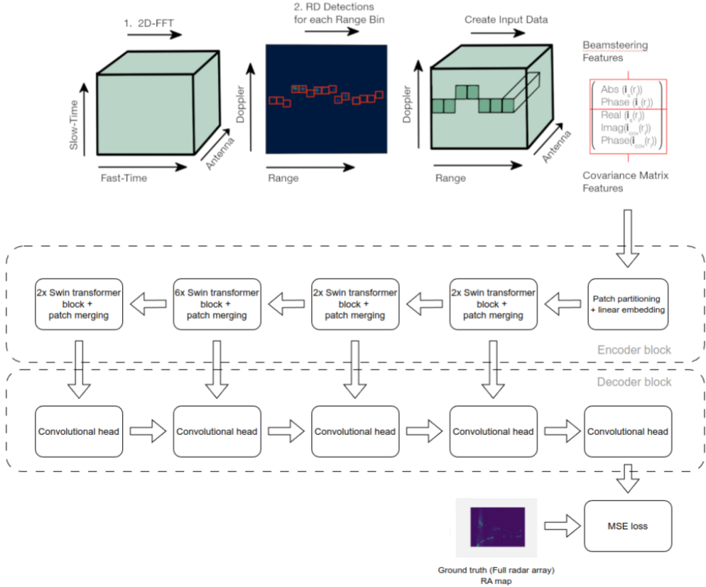

# Decluttering-And-Superresolution-for-Sparse-Radar-Arrays-with-Transformer-Based-Approaches

## Demo video

## Dataset
The used dataset is available [here](https://github.com/Xiangyu-Gao/Raw_ADC_radar_dataset_for_automotive_object_detection).

Alternatively, [RADIal](https://github.com/valeoai/RADIal) dataset can be used aswell.

## Code
For our implementation, please contact us by email: toomas.pruuden@marduk.ee

